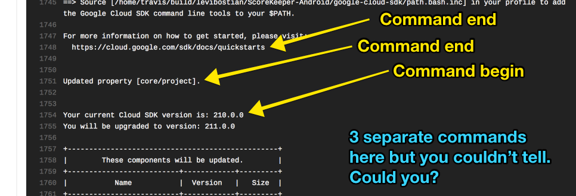

[](https://rubygems.org/gems/trent)
[](https://travis-ci.com/levibostian/Trent)
[](https://github.com/levibostian/trent)

# Trent

Run and debug bash commands on Travis-CI much easier. Make writing commands to run on your CI not painful. 

...Yes, Trent is open to working with more then Travis-CI. At this time, Travis is what I use so it's what's supported. Make a pull request to add more. 

## What is Trent?

I have been using Travis-CI for a few years to build, test, and deploy my apps. Bash is great, but using a higher level language for interacting with Travis and the build machine would be very beneficial. 

Trent is a convenient ruby gem that helps you execute system shell scripts with as little code *and pain* as possible. 

## How can Trent help you?

Have you encountered any of the following pains while working with Travis-CI? 

1. If you run shell commands from a bash *file*, Travis does not echo each command before it executes in the bash file. 



This makes it difficult to debug when things go wrong. Knowing what commands were executed would be very helpful. 

2. At times where I forget to set `set -e` in my bash script, commands that fail allow my Travis build to continue. Commands should fail by default to help keep Travis builds reliable. 

3. Some commands are ok if they fail. Make it easy to flag these commands as ok to fail. 

4. Bash is difficult to write and maintain if you do anything advanced. Parsing output from an executed command, for example, has always caused me trouble getting it to work. Using a high level language such as Python or Ruby is much easier. 

5. Misc tasks such as commenting on a GitHub pull request should be 1 line of code: `comment("Tests successful!")`. 

# Getting started 

* Install the gem via Bundler. 

```
$> bundle add trent

or...

$> gem install trent 
```

* Create a new Ruby file for the scripts you want to run and create an instance of `Trent`. 

```
require 'trent'

ci = Trent.new() 
```

* Tell Travis to run your scripts. In your `.travis.yml` file, add `ruby name-of-file.rb` for a job. 

Done! Continue reading for what you can do with Trent. 

# Run local shell commmands 

```ruby
require 'trent'

ci = Trent.new()

result = ci.sh("echo 'foo'")

puts result 
```

When you run the script, you will see:

```
echo 'foo'  
foo         
{:output=>"foo\n", :result=>true} 
```

Let's break this down. 

* `echo 'foo'`: Trent always prints to the console each command that is evaluated to help you debug. 
* `foo`: The output of the command that is executed. This includes both STDOUT and STDERR. 
* `{:output=>"foo\n", :result=>true} `: The result of `ci.sh()` returns a Hash with the output string you can parse if you wish and the result of the command. `true` for exit status code 0 and `false` otherwise. 

### Advanced tips for running local shell commands:

```ruby
# Allow a command to fail and not fail the Travis build. 
ci.sh("false", :fail_non_success => false) 

# Perform a string replace on your commands where "docker-compose" will be replaced with "/opt/bin/docker-compose"
ci.path("docker-compose", "/opt/bin/docker-compose")
```

# Run remote SSH shell commands

```ruby
require 'trent'

ci = Trent.new()
ci.config_ssh('username', '111.111.234.332', { :port => 22 })

result = ci.ssh("echo 'foo'")

puts result 
```

*Note: The 3rd parameter to `config_ssh` is a hash passed to [the options parameter of net/ssh](http://net-ssh.github.io/net-ssh/Net/SSH.html#method-c-start) to allow full customization.*

When you run the script, you will see:

```
echo 'foo'  
foo         
{:output=>"foo\n", :result=>true} 
```

Let's break this down. 

* `echo 'foo'`: Trent always prints to the console each command that is evaluated to help you debug. 
* `foo`: The output of the command that is executed. This includes both STDOUT and STDERR. 
* `{:output=>"foo\n", :result=>true} `: The result of `ci.ssh()` returns a Hash with the output string you can parse if you wish and the result of the command. `true` for exit status code 0 and `false` otherwise. 

### Advanced tips for running remote SSH shell commands

```ruby
# Allow a command to fail and not fail the Travis build. 
ci.ssh("false", :fail_non_success => false) 
```

# GitHub 

Trent comes with some handy commands that allow you to work with Travis easily. This would include interacting with GitHub. 

### Comment on a pull request 

```ruby
require 'trent'

ci = Trent.new()
# Set GitHub private access key to authenticate user account. 
# Here is a guide on how to create tokens:
# https://help.github.com/articles/creating-a-personal-access-token-for-the-command-line/#creating-a-token 
# Tokens for OSS Projects
# We recommend giving the token the smallest scope possible. This means just public_repo.
# Tokens for Closed Source Projects
# We recommend giving access to the whole repo scope, and its children.
ci.config_github('wfoweifwoeifjweoijwefowefweoif')

ci.github.comment("Tests pass!") # Send comment to pull request for the Travis build. The pull request information is automatically retrieved from the Travis virtual machine the build is running on. 
```

# Travis 

Trent comes with some handy commands that allow you to work with Travis, itself, easily. Here are some things you can do with it: 

### Skip rest of Trent commands if previous branch build failed and on a pull request 

When I am working on a project and I get it done, I tend to push up my branch to GitHub and then make a pull request right away to indicate it is complete. 

The problem is, if my branch build fails, the pull request build on Travis will still happen (and most likely fail if configured similar to my push commands). I would rather have Travis skip running some commands on a pull request build if the previous branch build failed. 

```ruby
require 'trent'

ci = Trent.new()
# Set Travis CI API key to authenticate user account. 
# Log into travis-ci.com or travis-ci.org (depending on where your repo is located), and browse to your profile page: https://travis-ci.com/account/preferences Copy the API key shown. 
# I like to store this API key in an environment variable. 
# Also indicate if this is a private repo or not. 
ci.config_travis(:api_key => ENV["TRAVIS_API_KEY"], :private_repo => true)

if TravisCI.pull_request? && ci.travis.branch_build_successful?
  # Do something if we are in a pull request and the most recent branch build was successful. 
end 

# Or, fail is Trent figures out we are in a pull request and the most recent branch build was not successful. 
ci.travis.fail_if_pr_branch_build_failed()
```

# Docs

Trent documentation is hosted [here](https://www.rubydoc.info/gems/trent/0.1.0). 

# Advanced Trent configuration 

```ruby
# Set the color Trent uses to print the command about to run to the console. 
# Available colors are located here: https://github.com/fazibear/colorize/blob/master/lib/colorize/class_methods.rb#L61
ci = Trent.new(:color => :green)
```

## Author

* Levi Bostian - [GitHub](https://github.com/levibostian), [Twitter](https://twitter.com/levibostian), [Website/blog](http://levibostian.com)


## Contribute

Trent is open for pull requests. Check out the [list of issues](https://github.com/levibostian/trent/issues) for tasks I am planning on working on. Check them out if you wish to contribute in that way.

At this time, Trent is a random collection of random tasks that I have found a use case for while working with CI servers. I see Trent being more of a core system that can run a series of plugins for you. I want to think of it as "The [Danger](https://danger.systems/) of creating scripts for CI servers" (aka: a convenience tool to help you write scripts quickly and painless with less bugs). 

**Want to add features to Trent?** Before you decide to take a bunch of time and add functionality to the library, please, [create an issue](https://github.com/levibostian/trent/issues/new) stating what you wish to add. This might save you some time in case your purpose does not fit well in the use cases of Trent.

### Building Trent 

```
$> bundle install --path vendor/bundle
$> bundle exec rake init 
```

This will install all dependencies including for development. You are ready to write some code. 

While working on Trent, make sure to lint it:

```
$> bundle exec rake lint 
```

To run tests and build Trent on your machine:

```
$> bundle exec rake build
```

Then, you can use it on your own machine using `require 'trent'` in your ruby scripts. 

### Where did the name come from?

I built this gem to work well with Travis-CI. I simply looked up similar names as "Travis". I liked how "Travis" and "Trent" share the same beginning couple of letters. 
